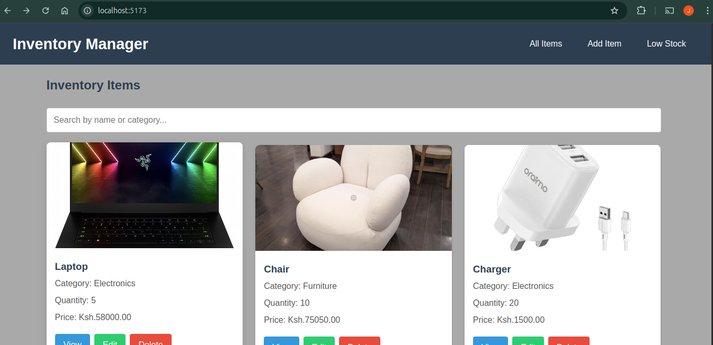

# Overview
The Inventory Manager is a comprehensive React-based web application designed to help users track and manage inventory items. This application provides full CRUD (Create, Read, Update, Delete) functionality with additional features for searching and filtering inventory items.

## Screenshot

# Features
 ## Complete Inventory Management:
   1. Add new inventory items
   2. View all items in a responsive grid
   3. Edit existing items
   4. Delete items when needed

 ## Advanced Filtering:
   1. Search items by name or category
   2. View low-stock items (quantity ≤ 5)
   3. Real-time filtering as you type

 ## User-Friendly Interface:

   1. Clean, modern design
   2. Responsive layout works on all device
   3. Intuitive navigation

 ## Data Persistence:
   1. Mock backend using JSON Server
   2. Persistent data storage
   3. Instant updates across all views

# Technologies Used
  ## Frontend:
    React 18
    React Router 6
    Axios for HTTP requests
    CSS for styling

  ## Backend:
    JSON Server (mock REST API)
    Local data storage (db.json)

# Installation
## Prerequisites
   Node.js (v16 or higher recommended)
   npm (comes with Node.js)
